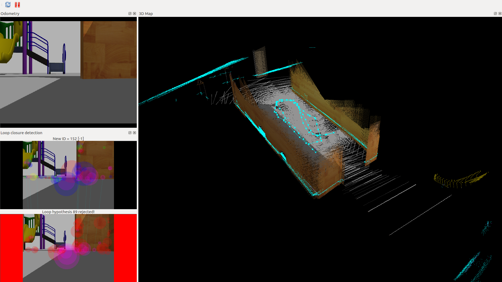
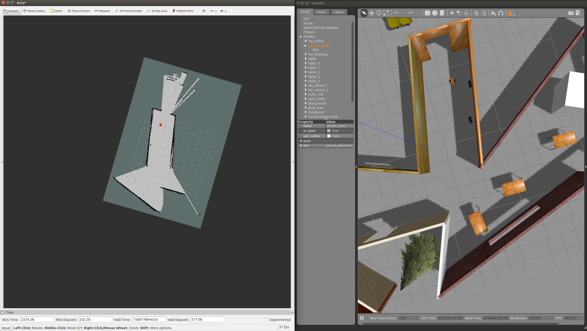

[](https://www.udacity.com/robotics)

# Udacity Nanodegree: Robotics Software Engineer

## Project 04: Map My World

### RTAB-map 


### Directory Structure

```
.map_my_world
├── docs
│   ├── rtab.png
│   └── rviz_gazebo.png
├── LICENSE
├── my_ball
│   ├── model.config
│   └── model.sdf
├── README.md
└── src
    ├── ball_chaser
    │   ├── CMakeLists.txt
    │   ├── launch
    │   │   └── ball_chaser.launch
    │   ├── package.xml
    │   ├── src
    │   │   ├── drive_bot.cpp
    │   │   └── process_image.cpp
    │   └── srv
    │       └── DriveToTarget.srv
    ├── CMakeLists.txt -> /opt/ros/kinetic/share/catkin/cmake/toplevel.cmake
    ├── my_robot
    │   ├── CMakeLists.txt
    │   ├── config
    │   │   ├── base_local_planner_params.yaml
    │   │   ├── costmap_common_params.yaml
    │   │   ├── global_costmap_params.yaml
    │   │   ├── local_costmap_params.yaml
    │   │   └── __MACOSX
    │   ├── launch
    │   │   ├── amcl.launch
    │   │   ├── localization.launch
    │   │   ├── mapping.launch
    │   │   ├── robot_description.launch
    │   │   └── world.launch
    │   ├── maps
    │   │   ├── my_map.pgm
    │   │   └── my_map.yaml
    │   ├── meshes
    │   │   └── hokuyo.dae
    │   ├── package.xml
    │   ├── urdf
    │   │   ├── my_robot.gazebo
    │   │   └── my_robot.xacro
    │   └── worlds
    │       ├── empty.world
    │       └── my_world.world
    └── teleop_twist_keyboard
        ├── CHANGELOG.rst
        ├── CMakeLists.txt
        ├── package.xml
        ├── README.md
        └── teleop_twist_keyboard.py
```

### How to run

#### 1. First of all, clone this repo:
```
git clone git@github.com:Suraj0712/map_my_world.git
```

#### 2. Launch the robot inside your world
This can be done by launching ```world.launch``` file:
```
$ cd map_my_world/
$ catkin_make
$ source devel/setup.bash
$ roslaunch my_robot world.launch
```

#### 3. Launch RTAB-Map
This can be done by launching ```mapping.launch``` file:
```
$ cd map_my_world/
$ catkin_make
$ source devel/setup.bash
$ roslaunch my_robot mapping.launch
```

#### 4. Run teleop node
```
$ cd map_my_world/
$ catkin_make
$ source devel/setup.bash
$ roslaunch my_robot teleop.launch
```

### RViz-Gazebo visualization 
